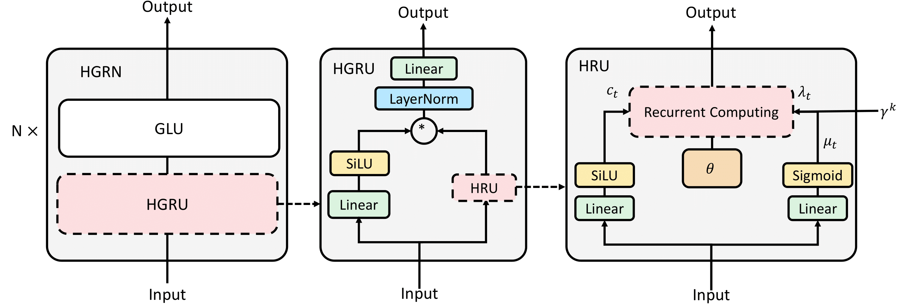

# HGRN

Official implementation of Hierarchically Gated Recurrent Neural Network for Sequence Modeling. This repo does not contain specific codes, but only scripts and some instructions on how to reproduce the results of the paper. The overall directory is as follows:

- [HGRN](#hgrn)
  - [Overall Architecture](#overall-architecture)
  - [Algorithm](#algorithm)
  - [Experiments](#experiments)
    - [Environment Preparation](#environment-preparation)
      - [Env1](#env1)
      - [Env2](#env2)
    - [Autoregressive language model](#autoregressive-language-model)
      - [1) Preprocess the data](#1-preprocess-the-data)
      - [2) Train the autoregressive language model](#2-train-the-autoregressive-language-model)
    - [Image modeling](#image-modeling)
    - [LRA](#lra)
      - [1) Preparation](#1-preparation)
      - [2) Training](#2-training)
  - [Standalone code](#standalone-code)


## Overall Architecture

The overall network architecture is as follows:

<div  align="center"> </div>

## Algorithm
The input is $\mathbf{x}_t \in \mathbb R^{d}$, where $d$ is the hidden dimension. First we compute the hidden states:

$$
\begin{aligned}
\mathrm{Re}\left(\mathbf{c}_t\right)=\mathrm{SiLU}\left(\mathbf{x}_t \mathbf{W}_{c r}+\mathbf{b}_{c r}\right) \in \mathbb{R}^{1 \times d}, \\
\mathrm{Im}\left(\mathbf{c}_t\right)=\mathrm{SiLU}\left(\mathbf{x}_t \mathbf{W}_{c i}+\mathbf{b}_{c i}\right) \in \mathbb{R}^{1 \times d}.
\end{aligned}
$$

Then we compute layer dependent lower bound as follows:

$$
\begin{aligned}
\mathbf{P} & =\left(\mathrm{Softmax}(\boldsymbol{\Gamma}, \mathrm{dim}=0) \in \mathbb{R}^{H \times d}\right. ,\\
\gamma^k & =[\mathrm{Cumsum}(\mathbf{P}, \mathrm{dim}=0)]_k \in \mathbb{R}^{1 \times d},
\end{aligned}
$$

where $H$ is the number of layers and 

$$
[\mathrm{Cumsum}(\mathbf{x})]_k=\sum_{i=1}^{k-1} x_i.
$$

We use this lower bound to compute forget gate:

$$
\begin{aligned}
& \mu_t=\mathrm{Sigmoid}\left(\mathbf{x}_t \mathbf{W}_\mu+\mathbf{b}_\mu\right) \in \mathbb{R}^{1 \times d}, \\
& \lambda_t=\gamma^k+\left(1-\gamma^k\right) \odot \mu_t \in \mathbb{R}^{1 \times d}.
\end{aligned}
$$

The full recurrence(HRU) is as follows:

$$
\mathbf{h}_t=\lambda_t \exp (i \theta) \cdot \mathbf{h}_{t-1}+\left(1-\lambda_t\right) \cdot \mathbf{c}_t \in \mathbb{C}^{1 \times d}.
$$

Combine $\mathbf h_t$ with the output gates and projection, we get the final result:

$$
\begin{aligned}
& \mathbf{g}_t=\tau\left(W_g \mathbf{x}_t+b_g\right) \in \mathbb{R}^{1 \times 2 d} \\
& \mathbf{o}_t^{\prime}=\mathrm{LayerNorm}\left(\mathbf{g}_t \odot\left[\mathrm{Re}\left(\mathbf{h}_t\right), \mathrm{Im}\left(\mathbf{h}_t\right)\right]\right) \in \mathbb{R}^{1 \times d} \\
& \mathbf{o}_t=\mathbf{o}_t^{\prime} \mathbf{W}_o+\mathbf{b}_o \in \mathbb{R}^{1 \times d}
\end{aligned}
$$

## Experiments

### Environment Preparation

Our experiment uses two conda environments, where Autoregressive language modeling, needs to configure the environment according to the Env1 part, and LRA needs to configure the environment according to the Env2 part.

#### Env1

First build the conda environment based on the yaml file:

```
conda env create --file env1.yaml
```

If you meet an error when installing torch, just remove torch and torchvision in the yaml file, rerun the above command, and then run the below commands:

```
conda activate hgrn
wget https://download.pytorch.org/whl/cu111/torch-1.8.1%2Bcu111-cp36-cp36m-linux_x86_64.whl
pip install torch-1.8.1+cu111-cp36-cp36m-linux_x86_64.whl
pip install -r requirements_hgrn.txt
```

Then, install `hgru-pytorch`:
```
conda activate hgrn
cd hgru-pytorch
pip install .
```

Finally, install our version of fairseq:

```
cd fairseq
pip install --editable ./
```


#### Env2

Build the conda environment based on the yaml file:

```
conda env create --file env2.yaml
```

If you encounter difficulties in setting up the environment, you can install the conda environment first, and then use the following command to install the pip packages:
```
pip install torch==1.10.0+cu111 torchvision==0.11.1+cu111 -f https://download.pytorch.org/whl/torch_stable.html
pip install -r requirements_lra.txt
```

Finally, install `hgru-pytorch`:
```
conda activate lra
cd hgru-pytorch
pip install .
```


### Autoregressive language model

#### 1) Preprocess the data

First download the [WikiText-103 dataset](https://www.salesforce.com/products/einstein/ai-research/the-wikitext-dependency-language-modeling-dataset/):

```
wget https://s3.amazonaws.com/research.metamind.io/wikitext/wikitext-103-raw-v1.zip
unzip wikitext-103-raw-v1.zip
```

Next, encode it with the GPT-2 BPE:

```
mkdir -p gpt2_bpe
wget -O gpt2_bpe/encoder.json https://dl.fbaipublicfiles.com/fairseq/gpt2_bpe/encoder.json
wget -O gpt2_bpe/vocab.bpe https://dl.fbaipublicfiles.com/fairseq/gpt2_bpe/vocab.bpe
for SPLIT in train valid test; do \
    python -m examples.roberta.multiprocessing_bpe_encoder \
        --encoder-json gpt2_bpe/encoder.json \
        --vocab-bpe gpt2_bpe/vocab.bpe \
        --inputs wikitext-103-raw/wiki.${SPLIT}.raw \
        --outputs wikitext-103-raw/wiki.${SPLIT}.bpe \
        --keep-empty \
        --workers 60; \
done
```

Finally, preprocess/binarize the data using the GPT-2 fairseq dictionary:

```
wget -O gpt2_bpe/dict.txt https://dl.fbaipublicfiles.com/fairseq/gpt2_bpe/dict.txt
fairseq-preprocess \
    --only-source \
    --srcdict gpt2_bpe/dict.txt \
    --trainpref wikitext-103-raw/wiki.train.bpe \
    --validpref wikitext-103-raw/wiki.valid.bpe \
    --testpref wikitext-103-raw/wiki.test.bpe \
    --destdir data-bin/wikitext-103 \
    --workers 60
```

This step comes from [fairseq](https://github.com/facebookresearch/fairseq/blob/main/examples/roberta/README.pretraining.md).


#### 2) Train the autoregressive language model

Use the following command to train language model:

```
bash script_alm.sh
```

You should change data_dir to preprocessed data.


### Image modeling

```
bash script_im.sh
```


### LRA

#### 1) Preparation

Download the codebase:

```
git clone https://github.com/OpenNLPLab/lra.git
```

Download the data:

```
wget https://storage.googleapis.com/long-range-arena/lra_release.gz
mv lra_release.gz lra_release.tar.gz 
tar -xvf lra_release.tar.gz
```


#### 2) Training

Use the following script to run the experiments, you should change `PREFIX` to your lra path, change `tasks` to a specific task:

```
python script_lra.py
```


## Standalone code
See [hgru-pytorch](https://github.com/Doraemonzzz/hgru-pytorch).

