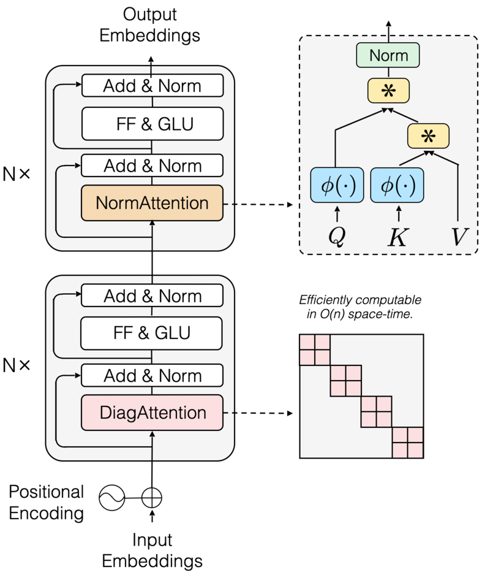

# Transnormer

Official implementation of Hierarchically Gated Recurrent Neural Network for Sequence Modeling. This repo does not contain specific codes, but only scripts and some instructions on how to reproduce the results of the paper. The overall directory is as follows:


- [Transnormer](#transnormer)
  - [Overall Architecture](#overall-architecture)
  - [Experiments](#experiments)
    - [Environment Preparation](#environment-preparation)
      - [Env1](#env1)
      - [Env2](#env2)
    - [Autoregressive language model](#autoregressive-language-model)
      - [1) Preprocess the data](#1-preprocess-the-data)
      - [2) Train the autoregressive language model](#2-train-the-autoregressive-language-model)
    - [Bidirectional language model](#bidirectional-language-model)
      - [1) Preprocess the data](#1-preprocess-the-data-1)
      - [2) Train the bidirectional language model](#2-train-the-bidirectional-language-model)
    - [LRA](#lra)
      - [1) Preparation](#1-preparation)
      - [2) Training](#2-training)
  - [Standalone code](#standalone-code)
  - [Citation](#citation)
  - [Wip](#wip)


## Overall Architecture

The overall network architecture is as follows:

<div  align="center"> </div>

 

## Experiments

### Environment Preparation

Our experiment uses two conda environments, where Autoregressive language modeling, Bidirectional language modeling needs to configure the environment according to the Env1 part, and LRA needs to configure the environment according to the Env2 part.

#### Env1

First build the conda environment based on the yaml file:

```
conda env create --file env.yaml
```

Then install our version of fairseq:

```
git clone https://github.com/OpenNLPLab/fairseq-evo.git
cd fairseq
pip install --editable ./
```


#### Env2

Build the conda environment based on the yaml file:

```
conda env create --file env2.yaml
```


### Autoregressive language model

#### 1) Preprocess the data

First download and prepare the [WikiText-103 dataset](https://www.salesforce.com/products/einstein/ai-research/the-wikitext-dependency-language-modeling-dataset/):

```
path_to_fairseq=fairseq
cd $path_to_fairseq/examples/language_model/
bash prepare-wikitext-103.sh
cd ../..
```

Next preprocess/binarize the data:

```
TEXT=examples/language_model/wikitext-103
fairseq-preprocess \
    --only-source \
    --trainpref $TEXT/wiki.train.tokens \
    --validpref $TEXT/wiki.valid.tokens \
    --testpref $TEXT/wiki.test.tokens \
    --destdir data-bin/wikitext-103 \
    --workers 20
```

This step comes from [fairseq](https://github.com/facebookresearch/fairseq/blob/main/examples/language_model/README.md).


#### 2) Train the autoregressive language model

Use the following command to train language model:

```
bash script_alm.sh
```

You should change data_dir to preprocessed data.


### Bidirectional language model

#### 1) Preprocess the data

First download the [WikiText-103 dataset](https://www.salesforce.com/products/einstein/ai-research/the-wikitext-dependency-language-modeling-dataset/):

```
wget https://s3.amazonaws.com/research.metamind.io/wikitext/wikitext-103-raw-v1.zip
unzip wikitext-103-raw-v1.zip
```

Next encode it with the GPT-2 BPE:

```
mkdir -p gpt2_bpe
wget -O gpt2_bpe/encoder.json https://dl.fbaipublicfiles.com/fairseq/gpt2_bpe/encoder.json
wget -O gpt2_bpe/vocab.bpe https://dl.fbaipublicfiles.com/fairseq/gpt2_bpe/vocab.bpe
for SPLIT in train valid test; do \
    python -m examples.roberta.multiprocessing_bpe_encoder \
        --encoder-json gpt2_bpe/encoder.json \
        --vocab-bpe gpt2_bpe/vocab.bpe \
        --inputs wikitext-103-raw/wiki.${SPLIT}.raw \
        --outputs wikitext-103-raw/wiki.${SPLIT}.bpe \
        --keep-empty \
        --workers 60; \
done
```

Finally preprocess/binarize the data using the GPT-2 fairseq dictionary:

```
wget -O gpt2_bpe/dict.txt https://dl.fbaipublicfiles.com/fairseq/gpt2_bpe/dict.txt
fairseq-preprocess \
    --only-source \
    --srcdict gpt2_bpe/dict.txt \
    --trainpref wikitext-103-raw/wiki.train.bpe \
    --validpref wikitext-103-raw/wiki.valid.bpe \
    --testpref wikitext-103-raw/wiki.test.bpe \
    --destdir data-bin/wikitext-103 \
    --workers 60
```

This step comes from [fairseq](https://github.com/facebookresearch/fairseq/blob/main/examples/roberta/README.pretraining.md).


#### 2) Train the bidirectional language model

Use the following command to train language model:

```
bash train_blm.sh
```

You should change data_dir to preprocessed data.


### LRA

#### 1) Preparation

Download the codebase:

```
git clone https://github.com/OpenNLPLab/lra.git
```

Download the data:

```
wget https://storage.googleapis.com/long-range-arena/lra_release.gz
mv lra_release.gz lra_release.tar.gz 
tar -xvf lra_release.tar.gz
```


#### 2) Training

Use the following script to run the experiments, you should change `PREFIX` to your lra path, change `tasks` to a specific task and change `model_config` to t1 or t2:

```
python script_lra.py
```


## Standalone code


## Citation

```
@inproceedings{qin-etal-2022-devil,
    title = "The Devil in Linear Transformer",
    author = "Qin, Zhen  and
      Han, Xiaodong  and
      Sun, Weixuan  and
      Li, Dongxu  and
      Kong, Lingpeng  and
      Barnes, Nick  and
      Zhong, Yiran",
    booktitle = "Proceedings of the 2022 Conference on Empirical Methods in Natural Language Processing",
    month = dec,
    year = "2022",
    address = "Abu Dhabi, United Arab Emirates",
    publisher = "Association for Computational Linguistics",
    url = "https://aclanthology.org/2022.emnlp-main.473",
    pages = "7025--7041",
    abstract = "Linear transformers aim to reduce the quadratic space-time complexity of vanilla transformers. However, they usually suffer from degraded performances on various tasks and corpus. In this paper, we examine existing kernel-based linear transformers and identify two key issues that lead to such performance gaps: 1) unbounded gradients in the attention computation adversely impact the convergence of linear transformer models; 2) attention dilution which trivially distributes attention scores over long sequences while neglecting neighbouring structures. To address these issues, we first identify that the scaling of attention matrices is the devil in unbounded gradients, which turns out unnecessary in linear attention as we show theoretically and empirically. To this end, we propose a new linear attention that replaces the scaling operation with a normalization to stabilize gradients. For the issue of attention dilution, we leverage a diagonal attention to confine attention to only neighbouring tokens in early layers. Benefiting from the stable gradients and improved attention, our new linear transformer model, transNormer, demonstrates superior performance on text classification and language modeling tasks, as well as on the challenging Long-Range Arena benchmark, surpassing vanilla transformer and existing linear variants by a clear margin while being significantly more space-time efficient. The code is available at https://github.com/OpenNLPLab/Transnormer .",
}
```


## Wip

- [ ] Check the training script.
- [ ] Add standalone code.
- [ ] Update transnormer-pytorch.
